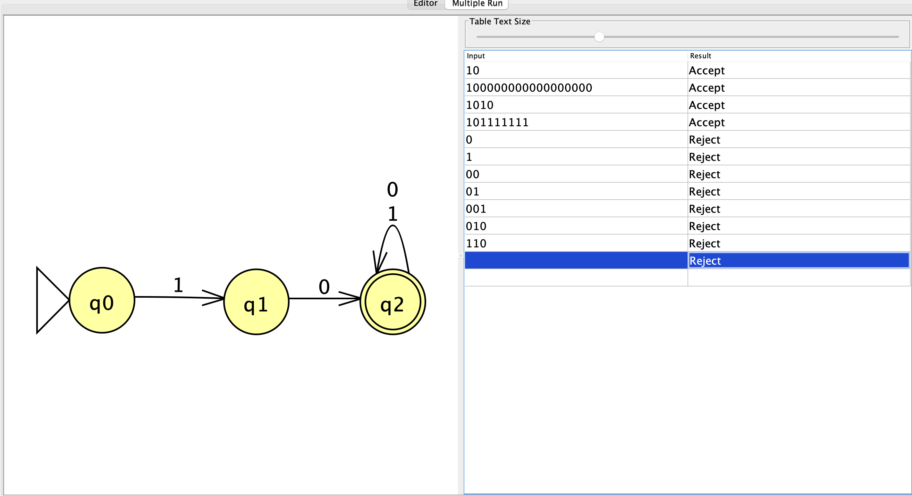

# Problem 6 — Strings That Start With `10`

## Language

The NFA recognizes:

\[
L=\{s\mid s\text{ starts with }10\}
\]

## NFA

### State Meanings

- `q0`: No input has been read yet.
- `q1`: The first symbol was `1`.
- `q2`: The input began with `10`. This is the accepting state.

If the input begins incorrectly, the computation has no available transition and dies. After reaching `q2`, both `0` and `1` loop because additional symbols cannot change the beginning of the string.

## Test Results

The test set includes the shortest accepted string, longer accepted strings, short rejected strings, incorrect prefixes, and strings that contain `10` without starting with it.

All test results matched the expected outcomes.

## Reflection

This problem taught me that an NFA can be simpler and more direct because an invalid computation can stop when no transition is available, instead of requiring an explicit trap state.
