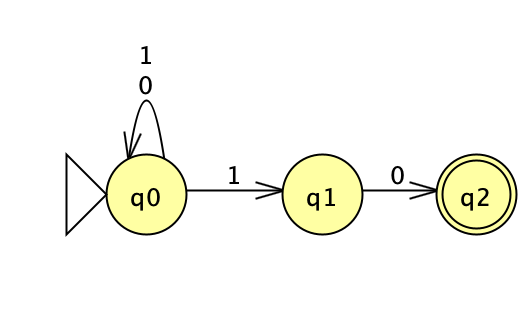
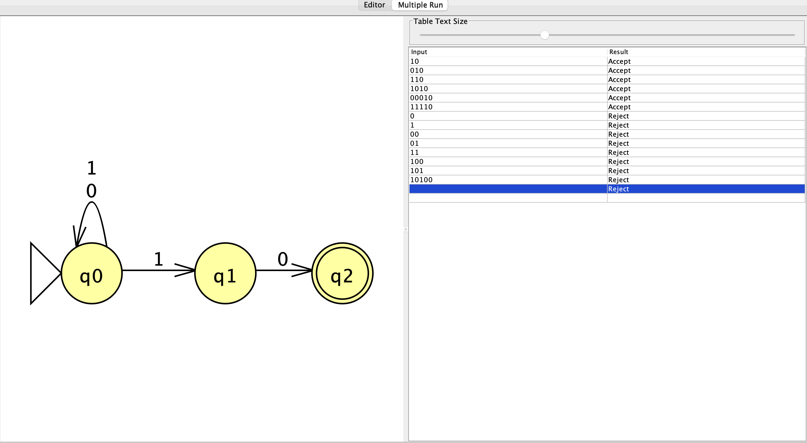
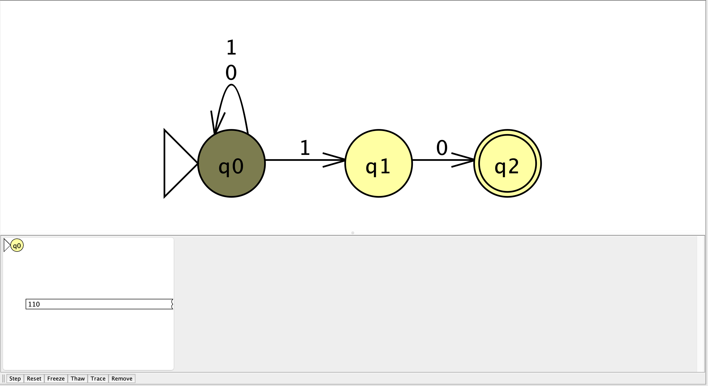
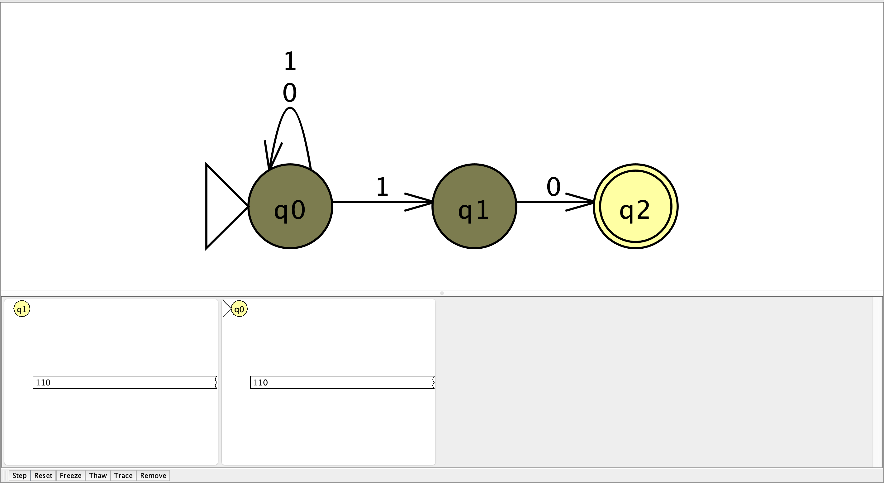
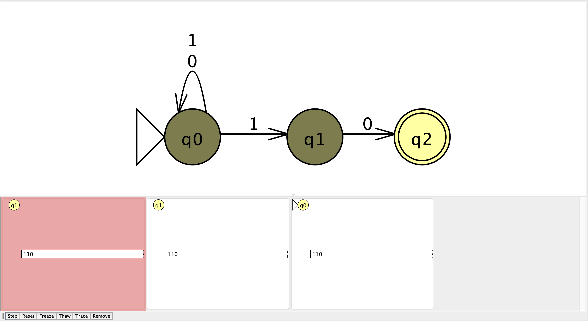
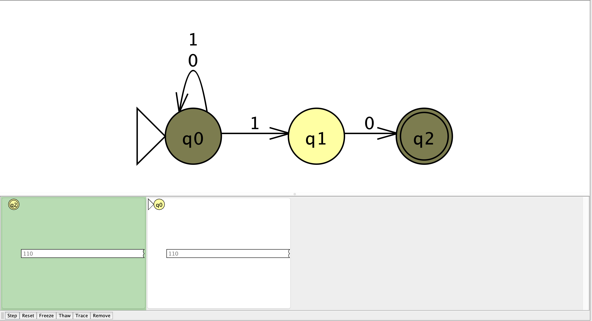
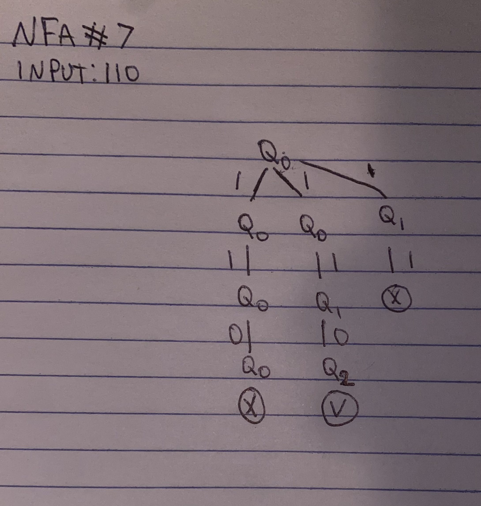

# Language

Binary strings that end with `10`.

# NFA

# State Meanings

- `q0`: start state and keeps reading the string
- `q1`: a `1` was found that could begin the final `10`
- `q2`: accepting state after reading the final `10`

# Test Results

The NFA correctly accepted strings that end with `10` and rejected strings that do not.

# Computation

Input: `110`

The input `110` is accepted because one path ends in `q2` after all input is read.

# Reflection

This problem helped me understand that an NFA can have multiple paths, and some of them can die. The string is still accepted as long as one path reaches the accepting state.
