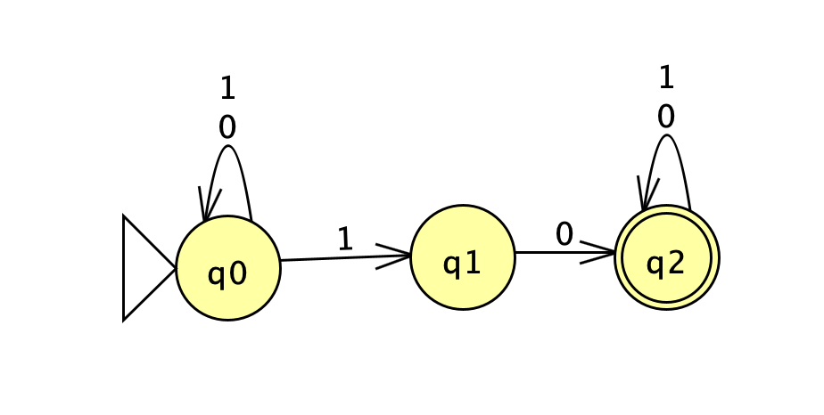
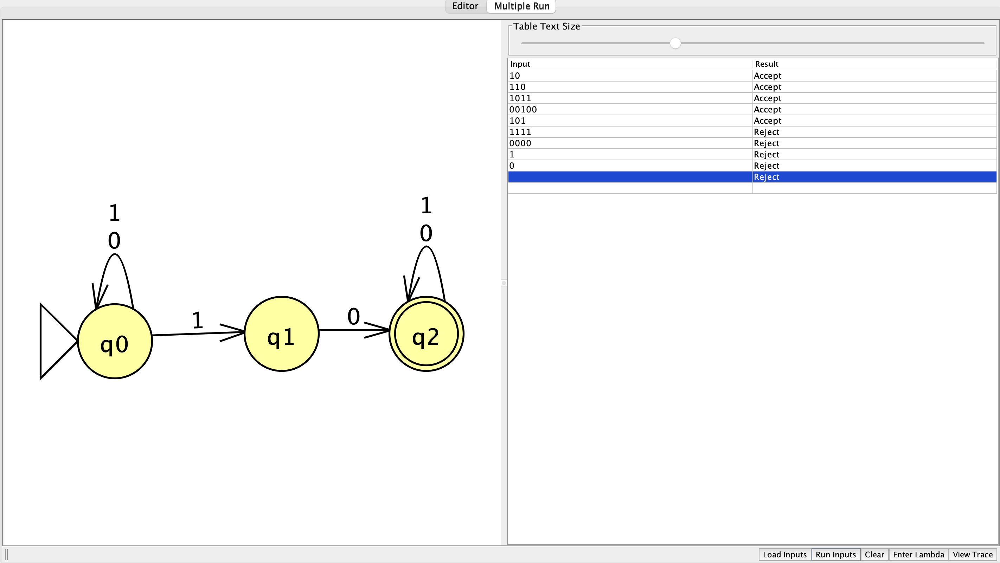
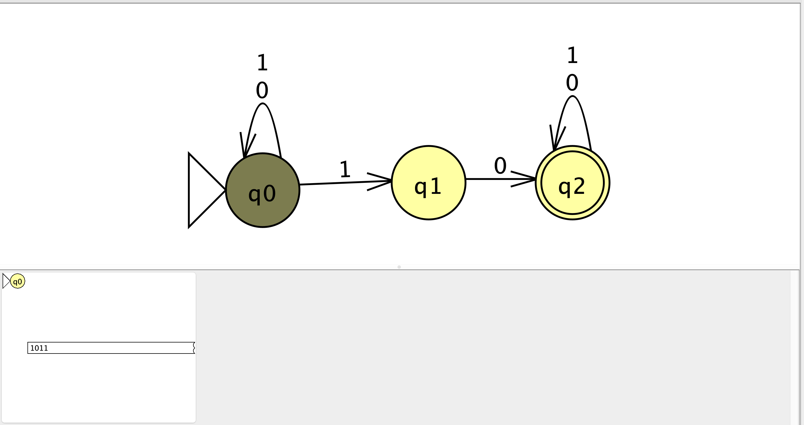
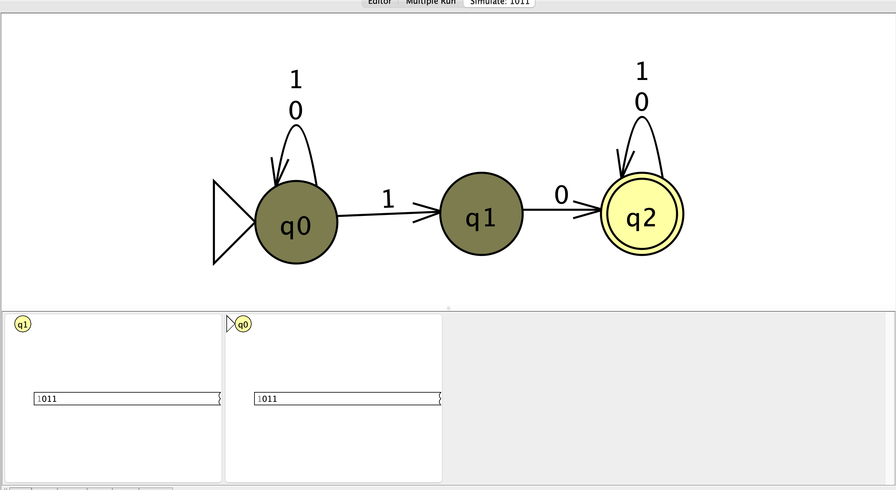
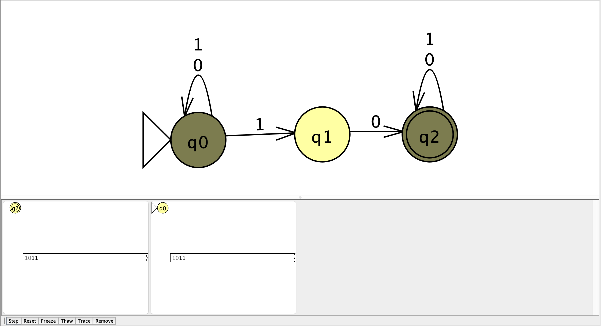
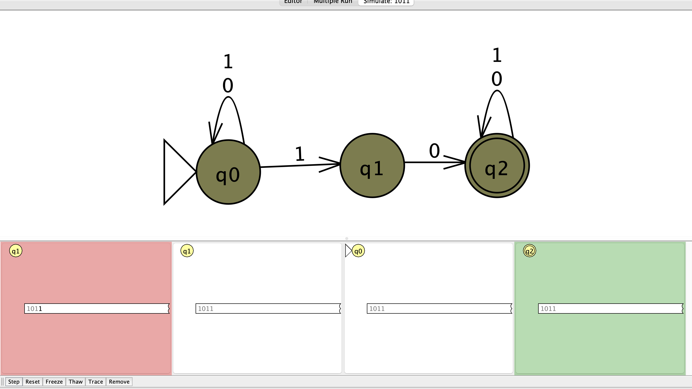
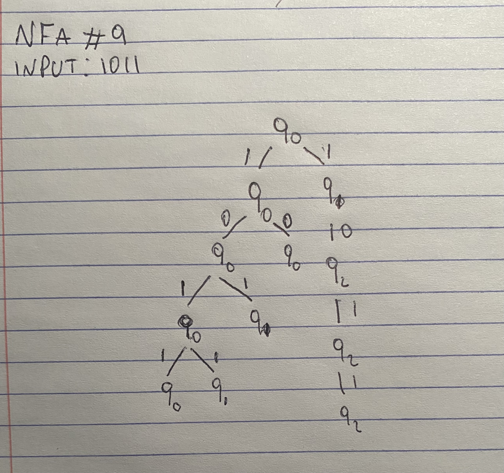

# Language

Binary strings that contain the substring `10`.

# NFA

# State Meanings

- `q0`: start state and keeps scanning the string
- `q1`: a `1` was found that could begin the substring `10`
- `q2`: accepting state after `10` has been found

# Test Results

The NFA correctly accepted strings that contain `10` and rejected strings that do not.

# Computation

Input: `1011`

The input `1011` is accepted because one path finds `10` and reaches `q2`. After reaching `q2`, the remaining symbols are accepted by the self-loop.

# Reflection

This problem helped me understand how an NFA can keep searching for a substring while also starting a new possible path. Once the substring `10` is found, the machine can stay in the accepting state for the rest of the input.
