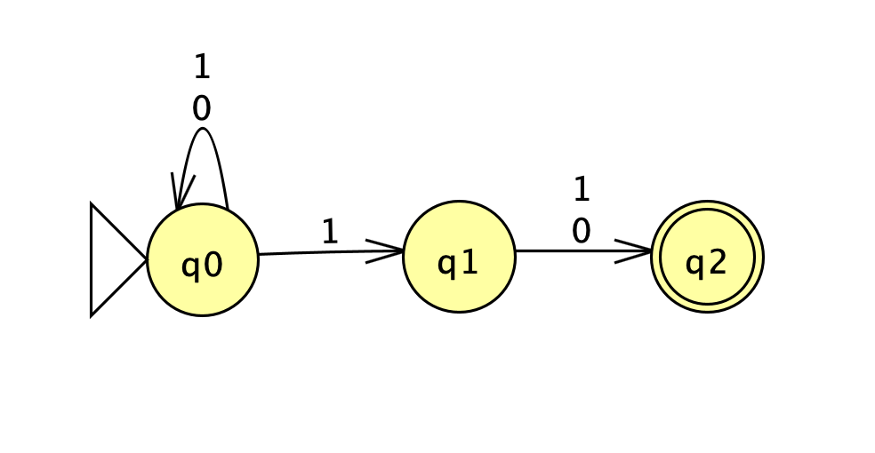
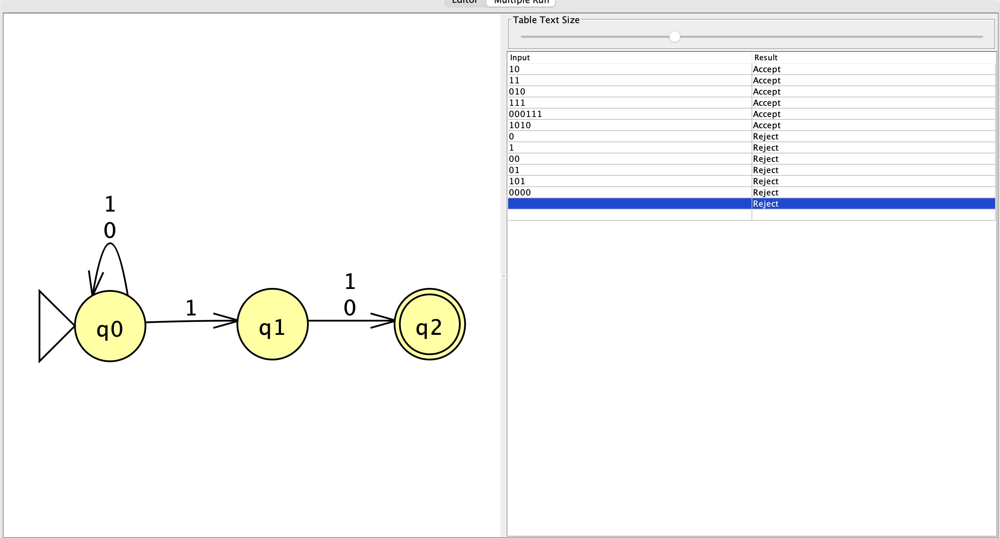
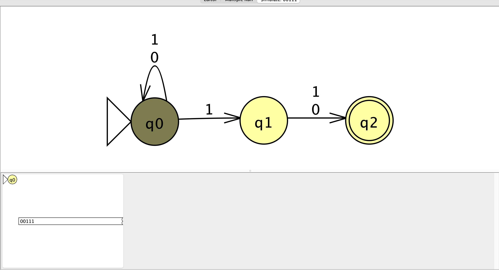
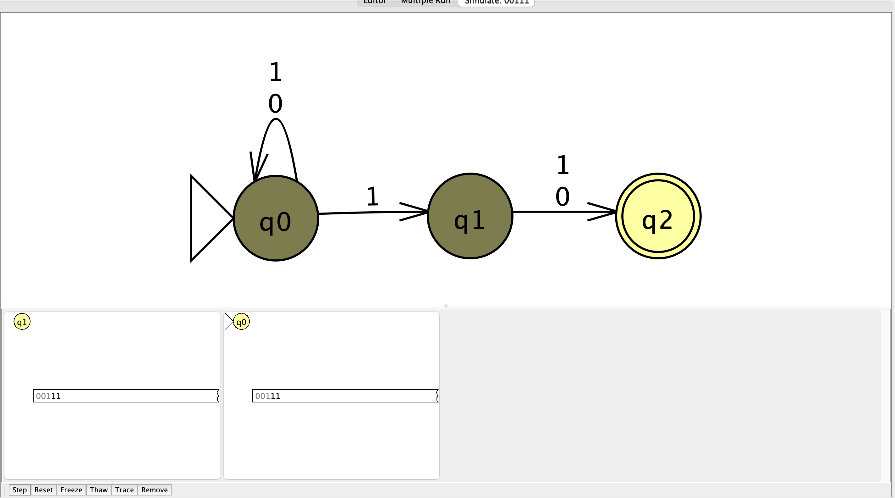
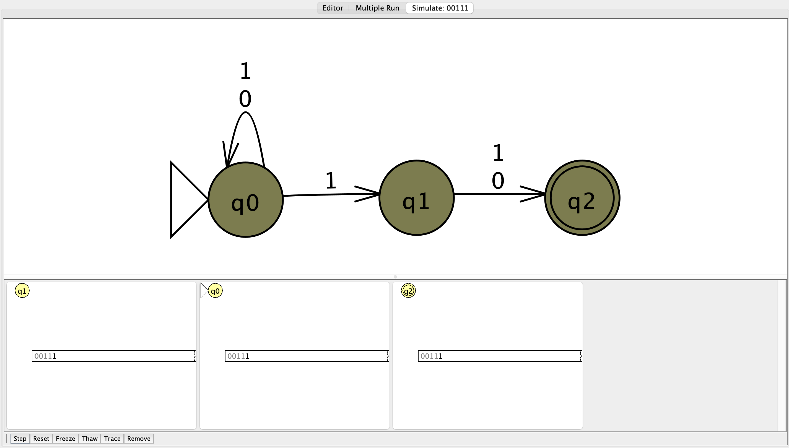
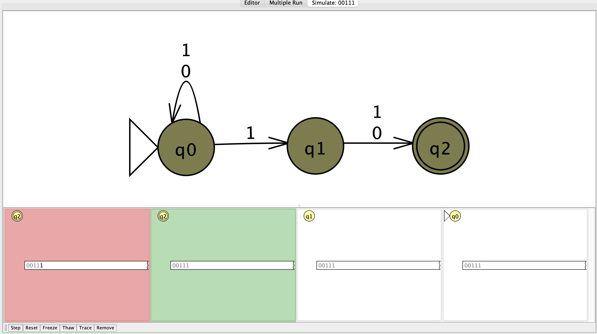
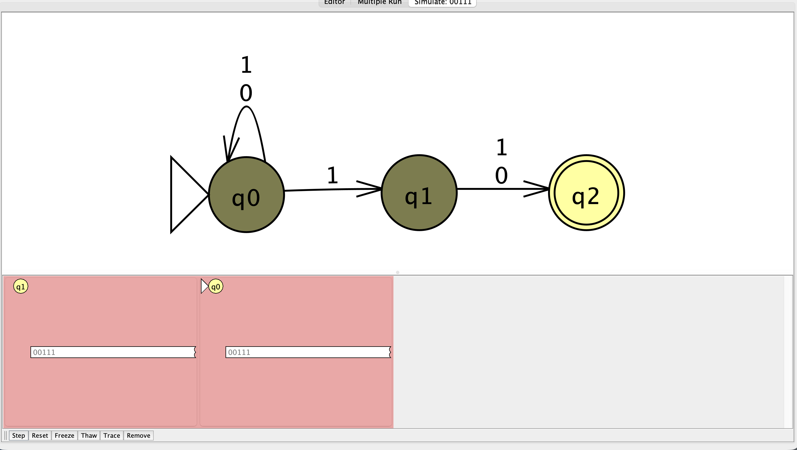
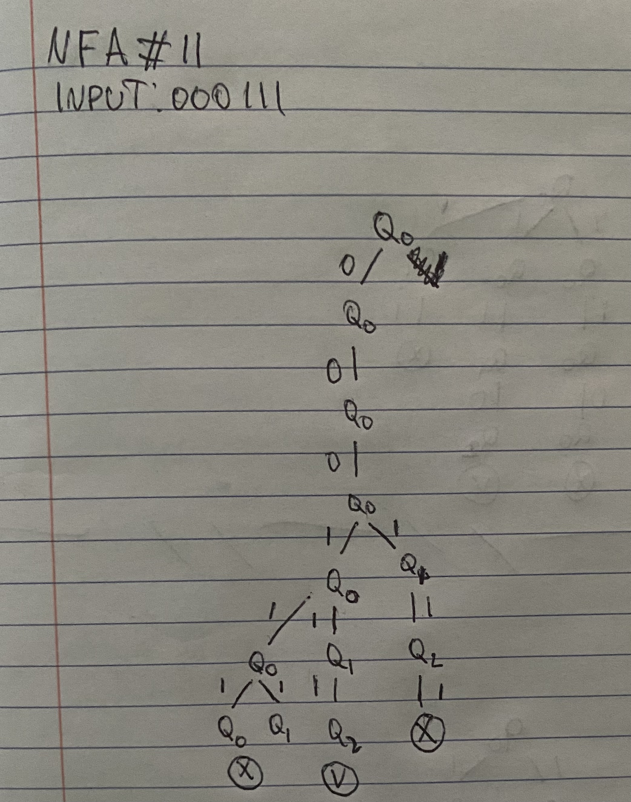

# Language

Binary strings where the second-to-last bit is `1`.

# NFA

# State Meanings

- `q0`: start state and keeps scanning the string
- `q1`: a `1` was found that could be the second-to-last symbol
- `q2`: accepting state after exactly one more symbol is read

# Test Results

The NFA correctly accepted strings where the second-to-last bit is `1` and rejected strings where it is not.

# Computation

Input: `000111`

The input `000111` is accepted because one path waits until the second-to-last `1`, moves to `q1`, and then reaches `q2` on the final symbol.

# Reflection

This problem helped me understand how an NFA can guess which `1` is the second-to-last symbol. If it guesses too early, that branch dies because `q2` has no outgoing transitions.
