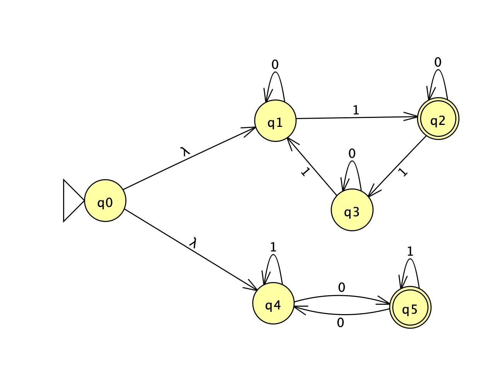
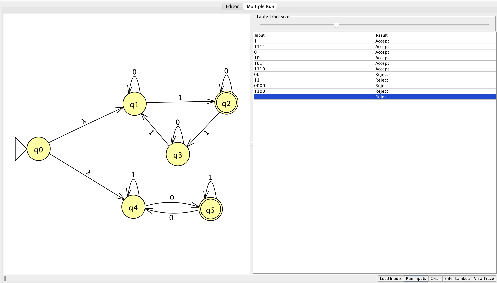

# Language

Binary strings with `3k + 1` ones or an odd number of zeros.

# NFA

# State Meanings

Upper branch:

- `q1`: number of `1`s is `0 mod 3`
- `q2`: number of `1`s is `1 mod 3`
- `q3`: number of `1`s is `2 mod 3`

Lower branch:

- `q4`: even number of `0`s
- `q5`: odd number of `0`s

The two λ-transitions from the start state let the NFA try both conditions. This implements the OR in the language.

# Test Results

The NFA correctly accepts strings that satisfy either condition and rejects strings that satisfy neither.

# Reflection

This problem helped me understand how to combine two NFAs using λ-transitions. One branch tracks the number of `1`s modulo 3, while the other tracks whether the number of `0`s is odd.
